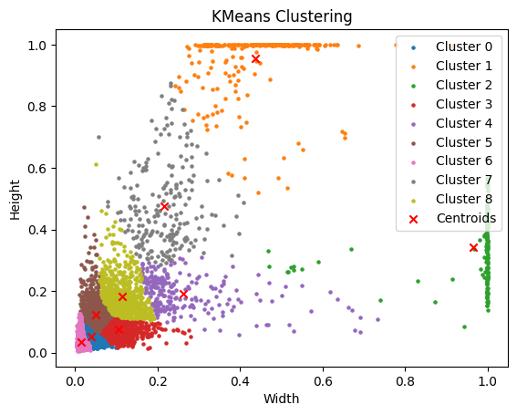

# YOLO-For-Turbines
Replicating YOLO v3 architecture according to the paper using PyTorch. Using pretrained yolov3.weights file, the model can detect and classify objects in images from the MSMSCOCO dataset. Currently fine tuning the model to detect dust and damage on wind turbines. 

**Link to project:** 

## How It's Made:

**Tech used:** Python, PyTorch, Scikit-Learn, Numpy, Albumentations, Streamlit

**Model architecture**: You-Only-Look-Once v3, or YOLOv3. Built from scratch following tutorial by @[Aladdin Persson](https://github.com/aladdinpersson) using PyTorch according to the official paper from @[Joseph Redmon](https://github.com/pjreddie). Added custom functions to load in just the trained backbone or fully trained model from the official YOLOv3 repo. 

**Custom Data Pipeline**: 
- Built a custom PyTorch Dataset to load in images and annotations and augment them according to model architecture
- Dataset supports multi scale training - every 10 batches, images in batches are enlarged by n*32 increment where n is a random integer from 0 to 6, following the official training procedure in the paper. 
- Wrote functions to convert yolo-formatted predictions, which are tensors at three different scales with format (batch_size, num_anchors = 3, grid_size, grid_size, bbox_coords + object_score + class_predictions), to bounding boxes for plotting on original image. 

**Mosaic Augmentation**:

Taking a page out of the training for YOLOv4, I implemented a custom function that performs mosaic augmentation. The algorithm loads four images in a 2x2 mosaic, then selects a point from the top left corner of the image that is between 20 to 30 percent of the entire mosaic. Then, it selects a cutout from the chosen corner and adjust the boxes in that cutout to match the cutout. This feature took quite a while to implement because there were a lot of edge cases to consider, such as making sure that one quadrant of the mosaic contained objects, and accounting for the fact that not every cutout would create a mosaic with objects. 

**Custom Anchors Using K-Means Clustering**:

- After observing that the widths and heights of the boxes for the wind turbine dataset were drastically different than that of MSCOCO's on a scatter plot, I used Scikit-Learn's K-Means Clustering algorithm to generate custom anchor boxes for my wind turbine defect model. I also wrote the algorithm from scratch for my own learning purposes. 

## Optimizations
**Vectorizing Non-Max Supression**:
- In order to calculate mAP or get the model's final predictions, we have to consider that the model will produce a lot of box predictions for the same object. Using Non-Max Suppression, we select boxes with the highest confidence score and remove all other boxes that have an iou greater than or equal to that of a threshold we designate. Rinse and repeat until you get the filtered, final model box predictions.
- I noticed during model training that training speed bottlenecked during the mAP calculation, which required NMS of the model box predictions.
- I changed an inner for loop to use vectorized PyTorch code instead, resulting in an over 100x speed boost.

## Lessons Learned:
- Implementing models is a hard but insightful learning experience that forces you to really understand the model architecture/nuances.
- You augment images to help the network see the image in a new but applicable context for your problem. For example, if your task is detecting small defects on wind turbines, a blur augmentation will harm model training because it will be even harder to distinguish the defect from the image. You would want augmentations that introduce new context to these defects while preserving or enhancing their visibility. This could be a reason why mosaic augmentation actually made performance worse when I tried using it to train on the wind turbine dataset.

## Future Work:
- As of 8/26/24, mAP@0.5 on the wind turbine dataset sits at 0.45. Looking into implementing the CSPDarknet53 backbone for more robust custom model with better feature extraction/ability to detect smaller objects. Goal is to achieve mAP of 0.60 or more. 