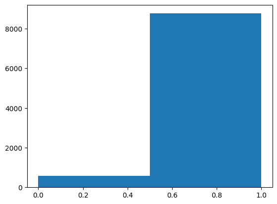
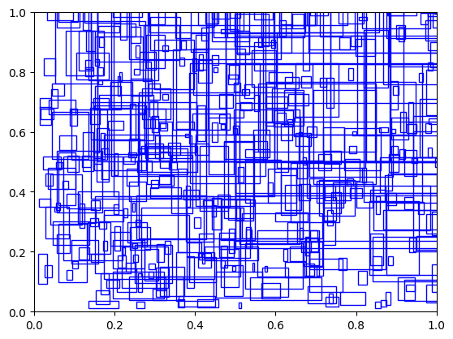
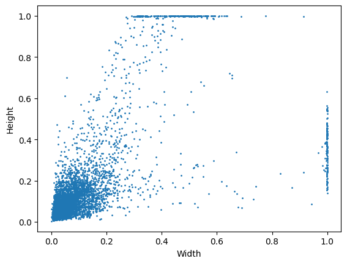
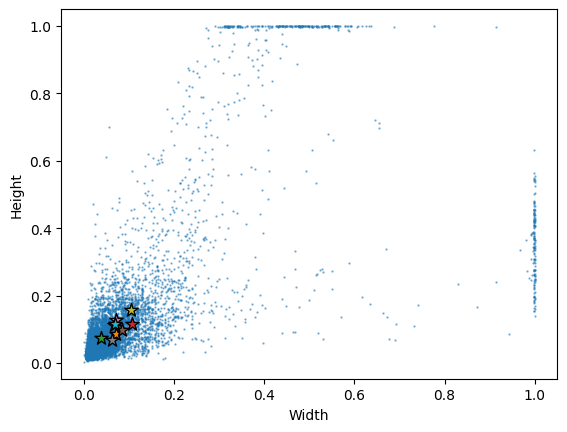
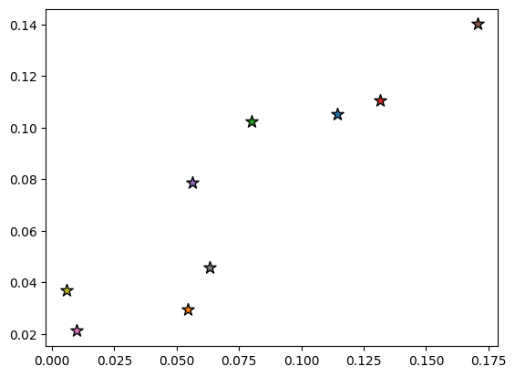

## K Means Clustering

YOLOv3 uses predefined anchor boxes as reference templates for object detection. The anchors are calculated using k-means clustering. Large image datasets like MS COCO already have precomputed anchor boxes but for more specialized datasets, custom anchors may need to be computed. The following notebook is my implementation of the algorithm in python for learning purposes. 


```python
import torch
import numpy as np
from pathlib import Path
import matplotlib.pyplot as plt
import matplotlib.patches as patches
import os
```


```python
data_folder_path = '../data/labels/'
```


```python
with open(Path(data_folder_path) / 'labels.txt', 'r') as f:
    lines = f.readlines()
lines
```


    ['dirt\n', 'damage']


```python
file_path = Path(f'{data_folder_path}/DJI_0004_02_05.txt')
```


```python
def get_box_data(data_folder_path):
    files = os.listdir(data_folder_path)
    boxes = []
    for i in range(len(files)):
        file_path = Path(f'{data_folder_path}/{files[i]}')
        if 'labels' not in file_path.name:
            file_boxes = np.loadtxt(file_path)
            if len(file_boxes.shape) == 1:
                file_boxes = np.expand_dims(file_boxes, axis=0)
            boxes.append(file_boxes) 
    return np.concatenate(boxes, axis = 0)
```


```python
all_boxes = get_box_data(data_folder_path)
plt.hist(all_boxes[:, 0], bins = 2)
```


    (array([ 581., 8770.]),
     array([0. , 0.5, 1. ]),
     <BarContainer object of 2 artists>)


    

    


```python
boxes = get_box_data(data_folder_path)[:, 1:]
```


```python
#Visualization of boxes. 

fig, ax = plt.subplots()
for i in range(int(boxes.shape[0] * 0.05)):
    box = boxes[i]
    rect = patches.Rectangle((box[0], box[1]), box[2], box[3], linewidth=1, edgecolor='b', facecolor='none')
    ax.add_patch(rect)
```


    

    


```python
#Visualization of height and width
plt.scatter(boxes[:, 2], boxes[:, 3], s = 1)
plt.xlabel('Width')
plt.ylabel('Height')
```


    Text(0, 0.5, 'Height')


    

    


```python
plt.hist(boxes[:, 2]/boxes[:, 3], bins = 300)
plt.xlabel('Width to Height Ratio')
plt.ylabel('Frequency')
```


    Text(0, 0.5, 'Frequency')


    

    


```python
#Handwritten IoU/Jaccard overlap function.
def IoU(boxes1, boxes2):
    """
    Calculate the Intersection over Union (IoU) of arrays of bounding boxes.
    Good to know how to do this manually instead of using a library function.

    Args:
        boxes1: (N, 4) or (4,) ndarray of float
        boxes2: (N, 4) or (4,) ndarray of float
    
    Returns:
        (N, ) ndarray of float
    
    """
    boxes1 = np.array(boxes1)
    boxes2 = np.array(boxes2)

    
    if boxes1.ndim == 1:
        boxes1 = boxes1.reshape(1, -1)
    if boxes2.ndim == 1:
        boxes2 = boxes2.reshape(1, -1)
        
    #Convert center coordinates to top left coordinates.
    boxes1[:, :2] = boxes1[:, :2] - boxes1[:, 2:]/2
    boxes2[:, :2] = boxes2[:, :2] - boxes2[:, 2:]/2

    xA = np.maximum(boxes1[:, 0], boxes2[:, 0])
    yA = np.maximum(boxes1[:, 1], boxes2[:, 1])
    xB = np.minimum(boxes1[:, 0] + boxes1[:, 2], boxes2[:, 0] + boxes2[:, 2])
    yB = np.minimum(boxes1[:, 1] + boxes1[:, 3], boxes2[:, 1] + boxes2[:, 3])
    box_width = np.maximum(0, xB - xA)
    box_height = np.maximum(0, yB - yA)
    intersection_area = box_width * box_height
    boxes1_area = boxes1[:, 2] * boxes1[:, 3]
    boxes2_area = boxes2[:, 2] * boxes2[:, 3]
    union_area = boxes1_area + boxes2_area - intersection_area
    iou = intersection_area / union_area
    return iou
```


```python
def IoU_width_height(boxes1, boxes2):
    """
    Calculate the Intersection over Union (IoU) of arrays of bounding boxes. 
    Assumes boxes are aligned at center. 
    """

    if boxes1.ndim == 1:
        boxes1 = boxes1.reshape(1, -1)
    if boxes2.ndim == 1:
        boxes2 = boxes2.reshape(1, -1)
    
    intersection = np.minimum(boxes1[..., 0], boxes2[..., 0]) * np.minimum(boxes1[..., 1], boxes2[..., 1])
    union = boxes1[..., 0] * boxes1[..., 1] + boxes2[..., 0] * boxes2[..., 1] - intersection
    iou = intersection / union
    return iou
```


```python
import torchvision 
from torchvision.ops import box_iou

#Comparing the handwritten IoU function with the PyTorch IoU function.

def IoU_torch(box1, box2):
    #Convert center coordinates to top left coordinates
    box1[:2] = (box1[:2] - box1[2:])/2
    box2[:2] = (box2[:2] - box2[2:])/2
    #Convert last two coordinates to bottom right coordinates
    box1[2:] += box1[:2]
    box2[2:] += box2[:2]
    box1 = torch.tensor(box1).unsqueeze(0)
    box2 = torch.tensor(box2).unsqueeze(0)
    return box_iou(box1, box2)
assert IoU(np.expand_dims(boxes[0], 0), np.expand_dims(boxes[1], 0)) - np.array(IoU_torch(boxes[0], boxes[1])) < 1e-5
```

    /var/folders/f1/3nybny351j5b_pmgq51tk7tr0000gn/T/ipykernel_90712/1726514783.py:16: DeprecationWarning: __array__ implementation doesn't accept a copy keyword, so passing copy=False failed. __array__ must implement 'dtype' and 'copy' keyword arguments.
      assert IoU(np.expand_dims(boxes[0], 0), np.expand_dims(boxes[1], 0)) - np.array(IoU_torch(boxes[0], boxes[1])) < 1e-5


1. Start with K centroids by putting them in a random place. Let's use k = 9 since that's the number of anchor boxes that Yolov3 uses. I stored all of the box data in a map. 


```python
def init_centroids_rand(boxes, k):
    centroids = np.random.choice(len(boxes), k)
    box_map = {}
    for i in range(len(centroids)):
        centroid = boxes[centroids[i]]
        box_map[i] = {'center': centroid, 'boxes': []}
    return box_map

```

2. Next, assign all points to centroids based on distance metric. The YOLOv3 authors use 1 - IOU as a distance metric instead of euclidean distance.


```python

def assign_boxes(boxes, k, box_map):
    for i in range(boxes.shape[0]):
        box = boxes[i]
        iou_list = []
        for j in range(k):
            iou = 1 - IoU_width_height(box, box_map[j]['center'])
            iou_list.append(iou)
        max_iou_idx = np.argmin(iou_list)
        box_map[max_iou_idx]['boxes'].append(box)
    return box_map
```

3. Recalculate centroids by computing mean width and height of newly assigned boxes


```python
def update_centroids(box_map):
    for i in range(len(box_map)):
        if len(box_map[i]['boxes']) > 0:
            box_map[i]['center'] = np.mean(box_map[i]['boxes'], axis = 0)
```

Note: Stop the model if we've exceeded a maximum number of iterations or centroids have stopped changing.


```python
MAX_ITERATIONS = 200000
def stop_condition(old_box_map, new_box_map, iterations):
    #stop if centroids don't change
    if iterations > MAX_ITERATIONS:
        return True
    for i in range(len(new_box_map)):
        if not np.allclose(old_box_map[i]['center'], new_box_map[i]['center']):
            return False
    return True

```

Full algorithm.


```python
def k_means(boxes, k):
    old_box_map = init_centroids_rand(boxes, k)
    new_box_map = init_centroids_rand(boxes, k)
    iter = 0
    while not stop_condition(old_box_map, new_box_map, iter):
        old_box_map = new_box_map
        new_box_map = assign_boxes(boxes, k, old_box_map)
        update_centroids(new_box_map)
        iter += 1
    for key, item in new_box_map.items():
        new_box_map[key]['boxes'] = np.vstack(item['boxes'])
    return new_box_map
```


```python
def plot_clusters(boxes, box_map):
    plt.scatter(boxes[:, 2], boxes[:, 3], s = 0.5, alpha = 0.5)

    for _, value in box_map.items():
        plt.scatter(value['center'][2], value['center'][3], s = 100, marker = '*', edgecolors= 'black')

    plt.xlabel('Width')
    plt.ylabel('Height')
```


```python
plot_clusters(boxes, k_means(boxes, 9))
```


    

    


Random initialization often leads to suboptimal centroids. Hence, we use k means plus plus. 

1. Randomly select the first centroid from the data points.
2. For each data point compute its distance from the nearest, previously chosen centroid.
3. Select the next centroid from the data points such that the probability of choosing a point as centroid is directly proportional to its distance from the nearest, previously chosen centroid. (i.e. the point having maximum distance from the nearest centroid is most likely to be selected next as a centroid)
4. Repeat steps 2 and 3 until k centroids have been sampled


```python
def k_means_plus_plus(boxes, k):
    box_map = {}
    centroids = []
    #pick a random centroid
    centroid = boxes[np.random.choice(len(boxes))]
    centroids.append(centroid)
    for i in range(1, k):
        #Calculate distances from nearest centroid
        distances = []
        for j in range(boxes.shape[0]):
            # Find the closest centroid for each box
            min_distance = min(1 - IoU_width_height(centroid, boxes[j]) for centroid in centroids)
            distances.append(min_distance)
        #Choose the next centroid based on squared distances
        squared_distances = (np.array(distances) ** 2).flatten()
        probabilities = squared_distances/np.sum(squared_distances)
        next_idx = np.random.choice(len(boxes), p=probabilities)
        centroids.append(boxes[next_idx])
    for i in range(len(centroids)):
        box_map[i] = {'center': centroids[i], 'boxes': []}
    return box_map
```


```python
better_box_map = k_means_plus_plus(boxes, 9)
```


```python
for i, value in better_box_map.items():
    plt.scatter(value['center'][2], value['center'][3], s = 100, marker = '*', edgecolors= 'black')
```


    

    


##### Final algorithm using k means plus plus to initialize centroids


```python
def k_means_improved(boxes, k):
    old_box_map = init_centroids_rand(boxes, k)
    new_box_map = k_means_plus_plus(boxes, k)
    iter = 0
    while not stop_condition(old_box_map, new_box_map, iter):
        old_box_map = new_box_map
        new_box_map = assign_boxes(boxes, k, old_box_map)
        update_centroids(new_box_map)
        iter += 1
    for key, item in new_box_map.items():
        new_box_map[key]['boxes'] = np.vstack(item['boxes'])
    return new_box_map
```


```python
box_map = k_means_improved(boxes, 9)
```


```python
#Sort centroids by size
sorted_centroids = sorted(box_map.items(), key = lambda x: x[1]['center'][2] * x[1]['center'][3], reverse = True)
```


```python
for key, value in sorted_centroids:
    print(f'Centroid {key}: {value["center"]}')
```

    Centroid 3: [0.69730244 0.44087063 0.10322437 0.14047119]
    Centroid 2: [0.30024942 0.5914419  0.07748741 0.12964422]
    Centroid 4: [0.32463223 0.13370087 0.07880889 0.08139865]
    Centroid 7: [0.07715469 0.75489437 0.05900771 0.10794654]
    Centroid 1: [0.73507075 0.83600304 0.07729995 0.08163972]
    Centroid 6: [0.76654314 0.10494375 0.05603646 0.07913145]
    Centroid 0: [0.06293728 0.25227185 0.04775008 0.08285015]
    Centroid 8: [0.70914698 0.03086966 0.05423103 0.04824337]
    Centroid 5: [0.32928114 0.02132886 0.03783881 0.03657486]


```python
plot_clusters(boxes, box_map)
```


    

    

