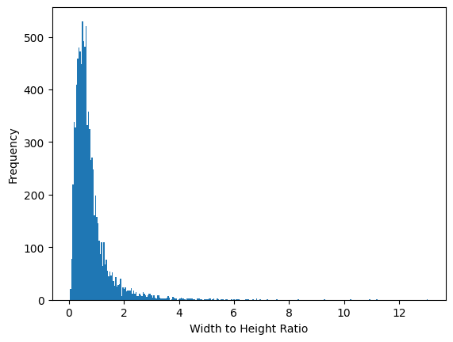
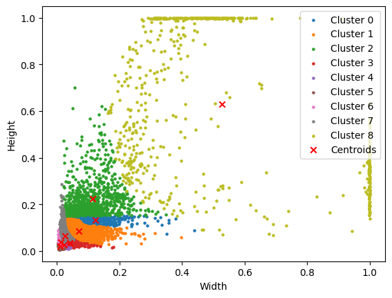
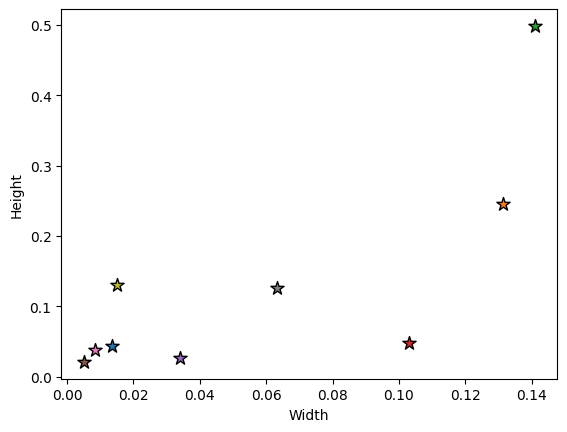
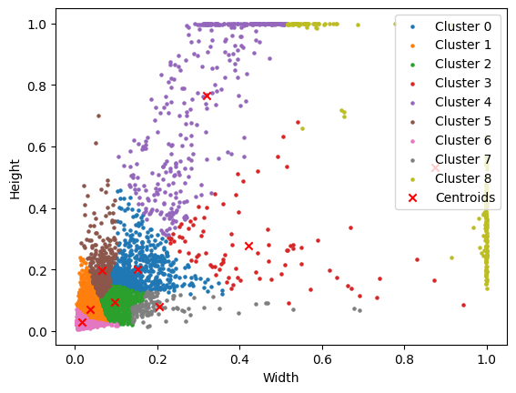
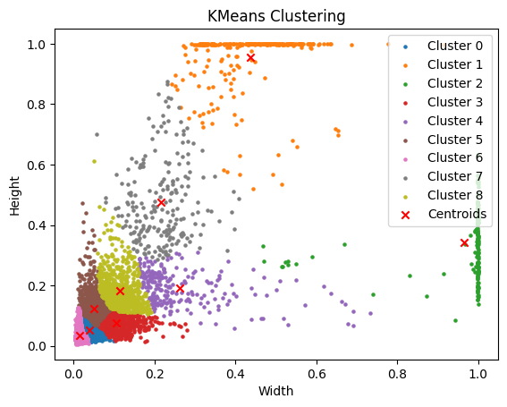

## K Means Clustering

YOLOv3 uses predefined anchor boxes as reference templates for object detection. The anchors are calculated using k-means clustering. Large image datasets like MS COCO already have precomputed anchor boxes but for more specialized datasets, custom anchors may need to be computed. The following notebook is my implementation of the algorithm in python for learning purposes. 


```python
import torch
import numpy as np
from pathlib import Path
import matplotlib.pyplot as plt
import matplotlib.patches as patches
import os
```


```python
data_folder_path = '../data/labels/'
```


```python
with open(Path(data_folder_path) / 'labels.txt', 'r') as f:
    lines = f.readlines()
lines
```


    ['dirt\n', 'damage']


```python
file_path = Path(f'{data_folder_path}/DJI_0004_02_05.txt')
```


```python
def get_box_data(data_folder_path):
    files = os.listdir(data_folder_path)
    boxes = []
    for i in range(len(files)):
        file_path = Path(f'{data_folder_path}/{files[i]}')
        if 'labels' not in file_path.name:
            file_boxes = np.loadtxt(file_path)
            if len(file_boxes.shape) == 1:
                file_boxes = np.expand_dims(file_boxes, axis=0)
            boxes.append(file_boxes) 
    return np.concatenate(boxes, axis = 0)
```


```python
all_boxes = get_box_data(data_folder_path)
plt.hist(all_boxes[:, 0], bins = 2)
```


    (array([ 581., 8770.]),
     array([0. , 0.5, 1. ]),
     <BarContainer object of 2 artists>)


    

    


```python
boxes = get_box_data(data_folder_path)
valid_x_y = np.logical_and(boxes[:, 1:3] >= 0, boxes[:, 1:3] <= 1)
valid_w_h = np.logical_and(boxes[:, 3:] > 0, boxes[:, 3:] <= 1)
valid_boxes = np.logical_and(valid_x_y, valid_w_h)
boxes = boxes[valid_boxes.all(axis = 1)]
```


```python
plt.hist(boxes[:, 3]/boxes[:, 4], bins = 300)
plt.xlabel('Width to Height Ratio')
plt.ylabel('Frequency')
```


    Text(0, 0.5, 'Frequency')


    

    


```python
#Handwritten IoU/Jaccard overlap function.
def IoU(boxes1, boxes2):
    """
    Calculate the Intersection over Union (IoU) of arrays of bounding boxes.
    Good to know how to do this manually instead of using a library function.

    Args:
        boxes1: (N, 4) or (4,) ndarray of float
        boxes2: (N, 4) or (4,) ndarray of float
    
    Returns:
        (N, ) ndarray of float
    
    """
    print(boxes1, boxes2)
    boxes1 = np.array(boxes1)
    boxes2 = np.array(boxes2)

    
    if boxes1.ndim == 1:
        boxes1 = boxes1.reshape(1, -1)
    if boxes2.ndim == 1:
        boxes2 = boxes2.reshape(1, -1)
        
    #Convert center coordinates to top left coordinates.
    boxes1[:, :2] = boxes1[:, :2] - boxes1[:, 2:]/2
    boxes2[:, :2] = boxes2[:, :2] - boxes2[:, 2:]/2

    xA = np.maximum(boxes1[:, 0], boxes2[:, 0])
    yA = np.maximum(boxes1[:, 1], boxes2[:, 1])
    xB = np.minimum(boxes1[:, 0] + boxes1[:, 2], boxes2[:, 0] + boxes2[:, 2])
    yB = np.minimum(boxes1[:, 1] + boxes1[:, 3], boxes2[:, 1] + boxes2[:, 3])
    box_width = np.maximum(0, xB - xA)
    box_height = np.maximum(0, yB - yA)
    intersection_area = box_width * box_height
    boxes1_area = boxes1[:, 2] * boxes1[:, 3]
    boxes2_area = boxes2[:, 2] * boxes2[:, 3]
    union_area = boxes1_area + boxes2_area - intersection_area
    iou = intersection_area / union_area
    return iou
```


```python
def IoU_width_height(boxes1, boxes2):
    """
    Calculate the Intersection over Union (IoU) of arrays of bounding boxes. 
    Assumes boxes are aligned at center. 

    Args:
        boxes1: (N, 2) or (2,) ndarray of float
        boxes2: (N, 2) or (2,) ndarray of float
    """

    if boxes1.ndim == 1:
        boxes1 = boxes1.reshape(1, -1)
    if boxes2.ndim == 1:
        boxes2 = boxes2.reshape(1, -1)
    
    intersection = np.minimum(boxes1[..., 0], boxes2[..., 0]) * np.minimum(boxes1[..., 1], boxes2[..., 1])
    union = boxes1[..., 0] * boxes1[..., 1] + boxes2[..., 0] * boxes2[..., 1] - intersection
    iou = intersection / union
    return iou
```

### K-Means Clustering

1. Start with K centroids by putting them in a random place. Let's use k = 9 since that's the number of anchor boxes that Yolov3 uses. I stored all of the box data in a map. 


```python
def init_centroids_rand(boxes, k):
    centroids = np.random.choice(len(boxes), k)
    box_map = {}
    for i in range(len(centroids)):
        centroid = boxes[centroids[i]]
        box_map[i] = {'center': centroid, 'boxes': []}
    return box_map

```

2. Next, assign all points to centroids based on distance metric. The YOLOv3 authors use 1 - IOU as a distance metric instead of euclidean distance.


```python

def assign_boxes(boxes, k, box_map):
    for i in range(boxes.shape[0]):
        box = boxes[i]
        iou_list = []
        for j in range(k):
            iou = 1 - IoU_width_height(box, box_map[j]['center'])
            iou_list.append(iou)
        max_iou_idx = np.argmin(iou_list)
        box_map[max_iou_idx]['boxes'].append(box)
    return box_map
```

3. Recalculate centroids by computing mean width and height of newly assigned boxes


```python
def update_centroids(box_map):
    for i in range(len(box_map)):
        if len(box_map[i]['boxes']) > 0:
            box_map[i]['center'] = np.mean(box_map[i]['boxes'], axis = 0)
```

Note: Stop the model if we've exceeded a maximum number of iterations or centroids have stopped changing.


```python
MAX_ITERATIONS = 500000
def stop_condition(old_box_map, new_box_map, iterations):
    #stop if centroids don't change
    if iterations > MAX_ITERATIONS:
        return True
    for i in range(len(new_box_map)):
        if not np.allclose(old_box_map[i]['center'], new_box_map[i]['center']):
            return False
    return True

```

Full algorithm.


```python
def k_means(boxes, k):
    old_box_map = init_centroids_rand(boxes, k)
    new_box_map = init_centroids_rand(boxes, k)
    iter = 0
    while not stop_condition(old_box_map, new_box_map, iter):
        old_box_map = new_box_map
        new_box_map = assign_boxes(boxes, k, old_box_map)
        update_centroids(new_box_map)
        iter += 1
    for key, item in new_box_map.items():
        new_box_map[key]['boxes'] = np.vstack(item['boxes'])
    return new_box_map
```


```python

def plot_clusters(boxes, box_map):
    for i, value in box_map.items():
        cluster = value["boxes"]
        plt.scatter(cluster[:, 0], cluster[:, 1], label=f'Cluster {i}', s = 5)
    cluster_centers_ = np.array([value['center'] for value in box_map.values()])
    plt.scatter(cluster_centers_[:, 0], cluster_centers_[:, 1], color='red', marker='x', label='Centroids')
    plt.legend(loc = 'upper right')
    plt.xlabel('Width')
    plt.ylabel('Height')
```


```python
boxes_wh = boxes[:, 3:]
box_map = k_means(boxes_wh, 9)
plot_clusters(boxes_wh, box_map)
```

    

    


Random initialization often leads to suboptimal centroids that may be clustered too close together. Notice how our dataset has two distinct groups of boxes with much larger widths and heights. We want the centroid with the largest width and height (the purple star) to be even closer to those groups. Hence, we use k means plus plus. 

### K-Means Plus Plus

1. Randomly select the first centroid from the data points.
2. For each data point compute its distance from the nearest, previously chosen centroid.
3. Select the next centroid from the data points such that the probability of choosing a point as centroid is directly proportional to its distance from the nearest, previously chosen centroid. (i.e. the point having maximum distance from the nearest centroid is most likely to be selected next as a centroid)
4. Repeat steps 2 and 3 until k centroids have been sampled


```python
def k_means_plus_plus(boxes, k):
    box_map = {}
    centroids = []
    #pick a random centroid
    centroid = boxes[np.random.choice(len(boxes))]
    centroids.append(centroid)
    for i in range(1, k):
        #Calculate distances from nearest centroid
        distances = []
        for j in range(boxes.shape[0]):
            # Find the closest centroid for each box
            min_distance = min(1 - IoU_width_height(centroid, boxes[j]) for centroid in centroids)
            distances.append(min_distance)
        #Choose the next centroid based on squared distances
        squared_distances = (np.array(distances) ** 2).flatten()
        probabilities = squared_distances/np.sum(squared_distances)
        next_idx = np.random.choice(len(boxes), p=probabilities)
        centroids.append(boxes[next_idx])
    for i in range(len(centroids)):
        box_map[i] = {'center': centroids[i], 'boxes': []}
    return box_map
```


```python
better_box_map = k_means_plus_plus(boxes_wh, 9)
```


```python
for i, value in better_box_map.items():
    plt.scatter(value['center'][0], value['center'][1], s = 100, marker = '*', edgecolors= 'black')
plt.xlabel('Width')
plt.ylabel('Height')
```


    Text(0, 0.5, 'Height')


    

    


##### Final algorithm using k means plus plus to initialize centroids


```python
def k_means_improved(boxes, k):
    old_box_map = init_centroids_rand(boxes, k)
    new_box_map = k_means_plus_plus(boxes, k)
    iter = 0
    while not stop_condition(old_box_map, new_box_map, iter):
        old_box_map = new_box_map
        new_box_map = assign_boxes(boxes, k, old_box_map)
        update_centroids(new_box_map)
        iter += 1
    for key, item in new_box_map.items():
        new_box_map[key]['boxes'] = np.vstack(item['boxes'])
    return new_box_map
```


```python
box_map = k_means_improved(boxes_wh, 9)
#Sort centroids by size
sorted_centroids = sorted(box_map.items(), key = lambda x: x[1]['center'][0] * x[1]['center'][1], reverse = True)
for key, value in sorted_centroids:
    print(f'Centroid {key}: {value["center"]}')
```

    Centroid 8: [0.87446633 0.53306323]
    Centroid 4: [0.31980473 0.76646783]
    Centroid 3: [0.42159424 0.27818934]
    Centroid 0: [0.15216333 0.19993068]
    Centroid 7: [0.20414104 0.07815664]
    Centroid 5: [0.06523085 0.19887119]
    Centroid 2: [0.09718028 0.09445283]
    Centroid 1: [0.03726812 0.07139271]
    Centroid 6: [0.01791475 0.02998719]


```python
plot_clusters(boxes_wh, box_map)
```


    

    


Now you can see that we've settled on more optimal anchors that are farther spread out and thus encompass the various widths and heights of the data's boxes. Let's use SciKit Learn's K-means clustering implementation to see how our implementation fares. 


```python
def iou(box1, box2):
    """
    Calculate the Intersection over Union (IoU) of two boxes.
    Boxes are in (width, height) format.
    """
    intersection = np.minimum(box1[0], box2[0]) * np.minimum(box1[1], box2[1])
    union = (box1[0] * box1[1]) + (box2[0] * box2[1]) - intersection
    return intersection / union
```


```python
def custom_distance(box1, box2):
    """
    Custom distance metric based on 1 - IoU.
    """
    return 1 - iou(box1, box2)
```


```python
from sklearn.cluster import KMeans

class CustomKMeans:
    def __init__(self, n_clusters, max_iter=1000, tol=1e-4):
        self.n_clusters = n_clusters
        self.max_iter = max_iter
        self.tol = tol
        self.cluster_centers_ = None

    def fit(self, X):
        # Initialize centroids
        kmeans = KMeans(n_clusters=self.n_clusters, max_iter=1, n_init=1)
        kmeans.fit(X)
        self.cluster_centers_ = kmeans.cluster_centers_

        for _ in range(self.max_iter):
            # Assign clusters based on custom distance
            distances = np.array([[custom_distance(x, center) for center in self.cluster_centers_] for x in X])
            labels = np.argmin(distances, axis=1)

            # Update centroids
            new_centers = np.array([X[labels == i].mean(axis=0) for i in range(self.n_clusters)])

            # Check for convergence
            if np.all(np.abs(new_centers - self.cluster_centers_) < self.tol):
                break

            self.cluster_centers_ = new_centers

    def predict(self, X):
        distances = np.array([[custom_distance(x, center) for center in self.cluster_centers_] for x in X])
        return np.argmin(distances, axis=1)
```


```python
# Example usage
boxes_wh = boxes[:, 3:]

n_clusters = 9
custom_kmeans = CustomKMeans(n_clusters=n_clusters)
custom_kmeans.fit(boxes_wh)

# Plot clusters
import matplotlib.pyplot as plt

labels = custom_kmeans.predict(boxes_wh)
sorted_centroids = np.array(sorted(custom_kmeans.cluster_centers_, key = lambda x: x[0] * x[1], reverse = True))
print("Sorted clusters")
print(sorted_centroids)
for i in range(n_clusters):
    cluster = boxes_wh[labels == i]
    plt.scatter(cluster[:, 0], cluster[:, 1], label=f'Cluster {i}', s = 5)
plt.scatter(custom_kmeans.cluster_centers_[:, 0], custom_kmeans.cluster_centers_[:, 1], color='red', marker='x', label='Centroids')
plt.xlabel('Width')
plt.ylabel('Height')
plt.legend(loc = 'upper right')
plt.title('KMeans Clustering')
plt.show()
```

    Sorted clusters
    [[0.43708957 0.95413507]
     [0.96614968 0.34158547]
     [0.21688574 0.47689602]
     [0.26286556 0.19207433]
     [0.11327912 0.18252201]
     [0.10629132 0.07504841]
     [0.05065195 0.12488623]
     [0.03883405 0.05335556]
     [0.01562711 0.03437581]]


    

    


So it looks like our algorithm could use some improvement. But it's a good start! This notebook was meant to be more of a learning exercise anyway. 
